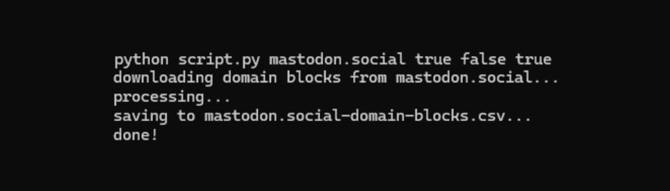

# Mastodon domain block exporter script

Export domain blocks from a Mastodon server into an importable CSV file.

To use the script, download and run `script.py` following the format:

```sh
python script.py domain reject_media reject_reports obfuscate
```

From Mastodon's [documentation](https://docs.joinmastodon.org/methods/admin/domain_blocks/#form-data-parameters):

- `reject_media`: Whether media attachments should be rejected.
- `reject_reports`: Whether reports from this domain should be rejected.
- `obfuscate`: Whether to partially censor the domain when shown in public.

An example command to download domain blocks from mastodon.social with `reject_media` and `obfuscate` set to `false`, and `reject_reports` set to true.

```sh
python script.py mastodon.social true false true
```
